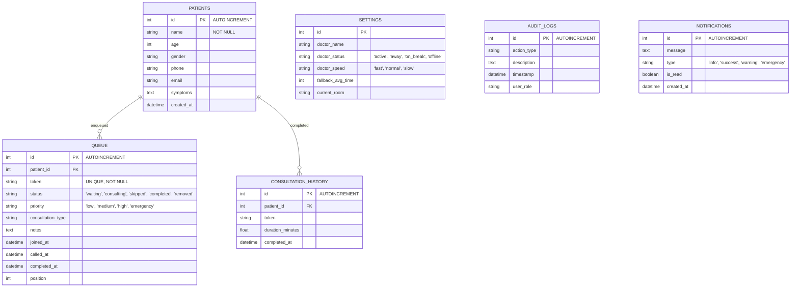

# 🏥 Queue Cure AI 2.0

> **Know Your Turn. Save Your Time.**  
> *An Enterprise-Grade, AI-Powered, Real-Time Clinic Queue Management SaaS Platform.*

Queue Cure AI 2.0 is a production-ready queue management platform designed to replace legacy paper tokens and chaotic waiting rooms. It synchronizes receptionist inputs with public patient screens in real-time, leverages machine learning principles to estimate waiting times, and features a conversational AI assistant to streamline administrative workflows.

---

## 🌟 Core Features

- **⚡ Real-Time Synchronization**: Powered by Flask-SocketIO. Instant updates propagate across receptionist dashboards, TV wait monitors, and patient mobile views without page refreshes.
- **🎙️ Live Voice Queue Assistant**: Floating mic controls that parse administrative voice commands (e.g. *"Call next patient"*, *"Who is next?"*, *"Show today's analytics"*), executing mutations via REST endpoints and reading responses. Includes built-in voice confirmation safety checks before executing destructive resets or deletions.
- **📱 Smart Patient Assistant**: Personalized tracking screens triggered by `?token=QC-XXX` parameters, displaying dynamic wait states (Relax 🟢, Get Ready 🟡, Proceed 🔴, Now Serving ✅) with accessibility check/bell/arrow icons, Framer Motion progress bars, and Web Audio/SpeechSynthesis alert chimes.
- **🧠 AI Smart Wait Prediction**: Estimates patient wait times using active queue depth, emergency patient bypass offsets, Doctor's consultation speed factors (Fast/Normal/Slow), and historical peak traffic hours.
- **🗣️ Voice Announcements (TTS)**: TV wait monitors trigger audio chime sound effects and speak called tokens aloud (e.g. *"Token QC-105, John Doe, proceed to Room 1"*).
- **📊 Live Analytics**: Beautiful responsive area charts, peak hour bar graphs, and consultation breakdown pie charts powered by Recharts.
- **🤖 Conversational AI Assistant**: A floating chat widget in the dashboard that reads database statistics and answers natural language administrative queries.
- **🚨 Emergency Triage Control**: Special priority flags bypass standard queues, instantly recalculating predictions for all waiting patients.
- **📱 Scan-to-Track QR Access**: TV screen displays a dynamic QR code. Patients can scan it to track their live position and remaining wait times on their phones.
- **🛡️ Concurrency Safe**: Implements database thread locks to prevent duplicate calls and SQLite locking collisions when multiple receptionists execute commands simultaneously.

---

## 🏗️ System Architecture

```mermaid
graph TD
    subgraph Client Layer (React Frontend)
        Admin[Receptionist Dashboard]
        TV[Patient Waiting Monitor]
        Mobile[Mobile Patient View]
    end

    subgraph Service Layer (Flask Backend)
        API[REST controller API]
        WS[Flask-SocketIO Server]
        AIEngine[AI Prediction & Chat Engine]
        QueueMgr[Thread-Locked Queue Manager]
    end

    subgraph Data Layer
        DB[(SQLite Database)]
    end

    Admin -- HTTP Mutations --> API
    API -- Triggers --> QueueMgr
    QueueMgr -- Writes --> DB
    QueueMgr -- Runs --> AIEngine
    AIEngine -- Reads --> DB
    
    QueueMgr -- Emits Events --> WS
    WS -- Broadcast State Updates --> Admin
    WS -- Broadcast State Updates --> TV
    WS -- Broadcast State Updates --> Mobile
```

---

## 🗄️ Database Design (ER Schema)



---

## 🛠️ Tech Stack

- **Frontend**: React (Vite), Tailwind CSS, Framer Motion, Recharts, React Hook Form, Socket.IO Client, Axios, Lucide Icons.
- **Backend**: Python 3, Flask, Flask-SocketIO, SQLAlchemy ORM, SQLite.
- **Testing**: Pytest (automated unit and integration suite).

---

## 📁 Repository Structure

```text
d:\GP\Queue\
│   README.md
│   thought_process.md
│   deployment_guide.md
│   socket_diagram.mermaid
│   
├───backend/
│   │   app.py                 # Main App Entry & REST Router
│   │   config.py              # Configuration values
│   │   requirements.txt       # Python Libraries
│   │   test_app.py            # Pytest test suite
│   │   
│   ├───database/
│   │       db.py              # db instance initialization
│   │       models.py          # SQLAlchemy Models
│   │       
│   └───services/
│           ai_engine.py       # ML wait times & Assistant Chatbot
│           queue_manager.py   # Concurrency-safe transitions
│
└───frontend/
    │   package.json
    │   tailwind.config.js
    │   postcss.config.js
    │   vite.config.js         # Port configuration & Proxies
    │   vercel.json            # Vercel proxy rewrite config
    │   index.html
    │   
    └───src/
        │   main.jsx
        │   App.jsx
        │   index.css
        │   
        ├───components/
        │       Navbar.jsx            # Header & Dr Status dropdown
        │       ThemeToggle.jsx       # Light/Dark mode
        │       StatCard.jsx          # Dashboard statistics
        │       RegistrationModal.jsx # React Hook Form registration
        │       QueueTable.jsx        # Admin table with filter & actions
        │       AnalyticsView.jsx     # Recharts charts container
        │       AiAssistant.jsx       # Conversational float chatbot
        │       Toast.jsx             # Sliding Toast alerts
        │       SoundAnnouncer.jsx    # Text-to-Speech announcer
        │       
        └───pages/
                LandingPage.jsx       # SaaS Marketing Landing page
                Dashboard.jsx         # Reception Panel
                PatientScreen.jsx     # Patient TV waiting board
```

---

## 🚀 Installation & Running Local

### 1. Backend Setup
Navigate to the workspace root directory:
```bash
# Install dependencies
pip install -r backend/requirements.txt

# Run pytest to verify installation
python -m pytest backend/test_app.py

# Launch backend server
python backend/app.py
```
*Backend server will start on `http://127.0.0.1:5000`.*

### 2. Frontend Setup
Open a second terminal window:
```bash
# Navigate to frontend folder
cd frontend

# Install node dependencies
npm install

# Launch Vite development server
npm run dev
```
*Vite server will start on `http://localhost:3000` (auto-proxies API and sockets to 5000).*

---

## 🔌 API Documentation (Prefix: `/api`)

- **`GET /api/settings`**: Returns current doctor configuration settings.
- **`PUT /api/settings`**: Updates doctor status, speed, default wait, and room values.
- **`POST /api/patients`**: Registers a patient and appends them to today's queue (auto-generates token).
- **`GET /api/queue`**: Returns today's active waiting queue.
- **`PUT /api/queue/:id`**: Edits patient record or manually updates queue positions.
- **`DELETE /api/queue/:id`**: Removes a patient from today's active queue.
- **`POST /api/queue/call-next`**: Auto-completes the current patient and pulls the next waiting patient based on priority.
- **`POST /api/queue/skip/:id`**: Marks a waiting patient as skipped.
- **`POST /api/queue/complete/:id`**: Marks a consultation completed (records duration).
- **`POST /api/queue/undo`**: Reverts the last queue action (add, call, skip, complete, remove).
- **`POST /api/queue/reset`**: Completely clears today's queue for a clean slate.
- **`GET /api/analytics`**: Computes Recharts statistics and daily AI insights.
- **`POST /api/ai/chat`**: Conversational endpoint for the administrative floating assistant.

---


